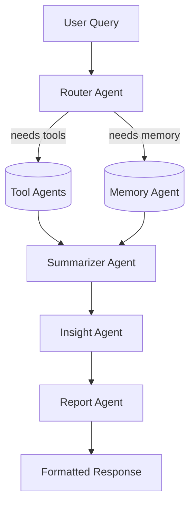

# Enterprise Intelligence Analyst (EIA)

**EIA** is a multi-agent, end-to-end AI system designed to serve as an internal business intelligence analyst. It allows organizations to:

* Ask natural-language questions over their data (SQL, CRM, logs).
* Upload and query documents (PDF, Excel, Word).
* Generate on-demand reports and insights.
* Recall past decisions and knowledge via long-term memory.
* Integrate with tools like Slack for notifications and dashboards for visualization.

---

## Table of Contents

1. [Features](#features)
2. [Architecture Overview](#architecture-overview)
3. [Prerequisites](#prerequisites)
4. [Installation & Setup](#installation--setup)
5. [Project Structure](#project-structure)
6. [Configuration](#configuration)
7. [Running the System](#running-the-system)
8. [Data Ingestion & Embedding](#data-ingestion--embedding)
9. [Testing](#testing)
10. [Deployment](#deployment)
11. [Contributing](#contributing)
12. [License](#license)

---
```
┌──────────────────┐    ┌───────────────────┐    ┌─────────────────┐
│ User Query Input │───▶│ Memory Agent      │───▶│ RAG Agent       │
└──────────────────┘    │ • fetch_short_term│    │ • text+image    │
                        │ • fetch_long_term │    │   retrievers    │
                        └───────────────────┘    └─┬───────────────┘
                                                      │
                                                      ▼
                                             ┌─────────────────┐
                                             │  LLM Chain      │
                                             │  (Gemini, etc.) │
                                             └─────────────────┘
                                                      │
                                         ┌────────────┴────────────┐
                                         │ Memory Agent (update)   │
                                         │ • store turn embeddings │
                                         │ • upsert user facts     │
                                         └─────────────────────────┘
                                                      │
                                                      ▼
                                                ┌──────────┐
                                                │  Response │
                                                └──────────┘

```
## Features

* **Multi-Agent Coordination:** Router, Tool, Memory, Summarizer, Insight, and Report agents.
* **Long-Term Memory:** Vector database (Chroma/Weaviate) backed semantic search.
* **Document Understanding:** PDF, Excel, and CSV parsing.
* **Tool Integrations:** SQL database, CRM API mock, web search.
* **Natural Language Interface:** Streamlit app or REST API with FastAPI.
* **Reporting:** PDF/HTML report generation.
* **Notifications (Optional):** Slack or email alerts for scheduled insights.

---

## Architecture Overview



* **Router Agent**: Decides which sub-agents to invoke.
* **Tool Agents**: Interfaces to SQL, PDF, Excel, CRM, etc.
* **Memory Agent**: Retrieves embeddings from vector store.
* **Summarizer Agent**: Cleans and consolidates raw outputs.
* **Insight Agent**: LLM reasoning to formulate answers.
* **Report Agent**: Formats into deliverables (JSON, PDF, HTML).

---

## Prerequisites

* Docker & Docker Compose
* Python 3.10+ and `pip`
* Node.js & npm (if using React frontend)
* OpenAI API key (for embeddings & LLM calls) or local LLaMA3 setup
* SQLite (for mock data) or PostgreSQL/MySQL for production

---

## Installation & Setup

1. **Clone repository**

   ```bash
   git clone https://github.com/yourusername/eia-system.git
   cd eia-system
   ```
2. **Copy env template**

   ```bash
   cp .env.example .env
   # Edit .env with your keys and database URLs
   ```
3. **Install Python dependencies**

   ```bash
   cd backend
   pip install -r requirements.txt
   ```
4. **Build & start services with Docker (Dev)**

   ```bash
   cd docker
   docker-compose up --build
   ```

---

## Project Structure

```
eia-system/
├── backend/            # FastAPI + LangGraph code
├── data/               # Mock data: CRM JSON, sales CSV, contracts
├── frontend/           # Streamlit or React UI
├── docker/             # Dockerfile & docker-compose for services
├── scripts/            # Helper scripts (start_dev, tests, deploy)
├── tests/              # Unit and integration tests
├── .env.example
└── README.md           # This file
```

See [backend README](backend/README.md) for deeper details.

---

## Configuration

All secrets and endpoints are managed in `.env`. Key variables:

```dotenv
OPENAI_API_KEY=your_openai_key
VECTOR_DB_PATH=/data/vector_store.db
SQLITE_DB_PATH=/data/mock_data.db
JWT_SECRET=supersecret
```

---

## Running the System

1. **Ingest mock data**

   ```bash
   python backend/embeddings/ingest_mock_data.py
   ```
2. **Embed documents**

   ```bash
   python backend/embeddings/embed_docs.py
   ```
3. **Start FastAPI server**

   ```bash
   uvicorn backend.main:app --reload --port 8000
   ```
4. **Launch frontend**

   ```bash
   cd frontend
   streamlit run streamlit_app.py
   ```
5. **Access UI** at `http://localhost:8501` and API at `http://localhost:8000/docs`

---

## Data Ingestion & Embedding

* **`backend/embeddings/ingest_mock_data.py`**: Loads CRM & sales into SQLite.
* **`backend/embeddings/embed_docs.py`**: Extracts text from PDFs and stores embeddings.

Customize or extend these for your own data sources.

---

## Testing

* **Unit tests** in `tests/unit/`
* **Integration tests** in `tests/integration/`

Run all tests:

```bash
cd backend
pytest
```

---

## Deployment

* **Docker Compose** for local/staging.
* **Deploy** to Railway, Render, or self-hosted VPS.
* Ensure environment variables and secrets are configured.

---

## Contributing

1. Fork the repo
2. Create a feature branch (`git checkout -b feature/my-agent`)
3. Commit your changes (`git commit -m "Add new agent"`)
4. Push to your branch (`git push origin feature/my-agent`)
5. Open a Pull Request

Be sure to run tests and follow code style guidelines.

---

## License

This project is licensed under the MIT License. See [LICENSE](LICENSE) for details.
